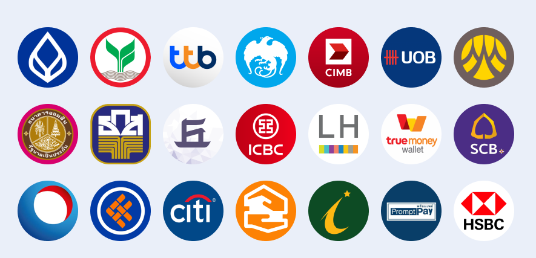

# Thai Banks Logo
- รวมรูปภาพธนาคารทั้งหมด 21 ธนาคาร
- รองรับการใช้ TypeScript
- รองรับการใช้ ES6

## Installation

```
pnpm i thai-banks-logo
# or
yarn add thai-banks-logo
```

## Example usage

```javascript
import thaiBanks from 'thai-banks-logo'
import type { Bank } from 'thai-banks-logo/types'

const baacBank: Bank = bankLists['KBANK']
console.log(baacBank.name) // Output: กสิกรไทย
console.log(baacBank.symbol) // Output: KBANK
console.log(baacBank.color) // Output: #000000
console.log(bankLists) // Show all bank lists
```



```
List of Thai Banks 21 banks include:

- พร้อมเพย์ (PromptPay)
- ทรูมันนี่ (TrueMoney)
- ธนาคารไทยพาณิชย์ (SCB)
- ธนาคารกสิกรไทย (KBANK)
- ธนาคารกรุงไทย (KTB)
- ธนาคารกรุงศรีอยุธยา (BAY)
- ธนาคารกรุงเทพ (BBL)
- ธนาคารทีเอ็มบีธนชาต (TMB)
- ธนาคารซีไอเอ็มบี (CIMB)
- ธนาคารซิตี้แบงก์ (CITI)
- ธนาคารอาคารสงเคราะห์ (GHB)
- ธนาคารออมสิน (GSB)
- ธนาคารเอชเอสบีซี (HSBC)
- ธนาคารอิสลามแห่งประเทศไทย (IBANK)
- ธนาคารไอซีบีซี (ICBC)
- ธนาคารเกียรตินาคินภัทร (KKP)
- ธนาคารแลนด์ แอนด์ เฮ้าส์ (LHB)
- ธนาคารไทยเครดิต (TCRB)
- ธนาคารทิสโก้ (TISCO)
- ธนาคารยูโอบี (UOB)
- ธนาคารเพื่อการเกษตรและสหกรณ์การเกษตร (BAAC)
```

## Details

- Bank logo .PNG
- Bank name Thai and English
- Bank symbol
